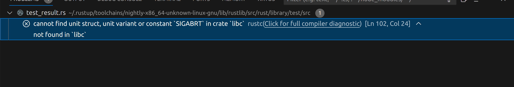
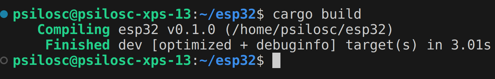
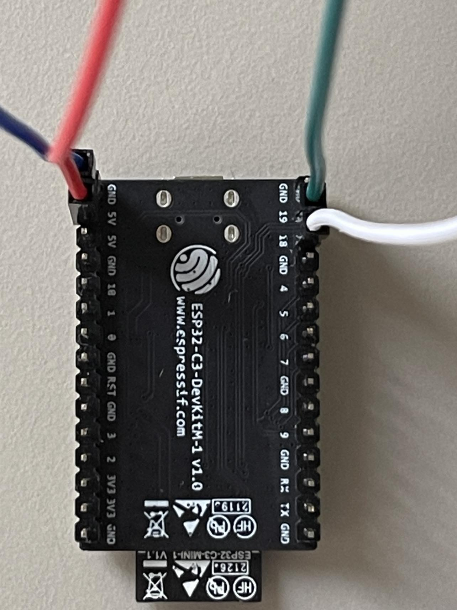

# README 

This is a guide on how to properly set up the project. Before we start, make sure that:

 1. You are using an ESP32C3-DevKit-M1 as the development board. 
 2. You are using Ubuntu Linux (22.04 or newer) as your main OS.
 3. You are using VSCode as your IDE.

*Note: You can still use a different development board but you might have to change a few things.*

It is assumed that rust is already installed. If not, check out their website [here](https://www.rust-lang.org/tools/install) for instructions on how to install it. Nightly rust is used for this project

## Pre-requisites 
### Install Rust
To begin with, you need to install Rust. You can do so by using the following command:
```bash
curl --proto '=https' --tlsv1.2 -sSf https://sh.rustup.rs | sh
```
Follow the on-screen instructions once the installation menu opens. To make sure that Rust was installed correctly, re-open the terminal and run:
```bash
rustup --version
```
Please visit the rust website by clicking [here](https://www.rust-lang.org/tools/install) in case that you get no output or errors.

Note: This project makes use of nightly rust (nightly-2023-12-30 to be exact) as the latest builds introduce a new error that has not been solved in the time of writing this readme (18-Mar-2024):

<div align="center">
	
	<p>Figure 1. Common problem with new nightly builds. </p>
</div>

However, you can edit the "rust-toolchain.toml" file to use any other version you like.

### Install ESP-IDF pre-requisites
This project requires installing the esp-idf plugin from the VSCode plugin store. Before you do that, you need to install the following prerequisites:
```bash
sudo  apt-get  install  git  wget  flex  bison  gperf  python3  python3-pip  python3-venv  cmake  ninja-build  ccache  libffi-dev  libssl-dev  dfu-util  libusb-1.0-0 libudev-dev
```

### Install cargo Sub-commands
In regards to Rust, the following cargo packages are required:
```bash
cargo  install  cargo-generate
cargo  install  ldproxy
cargo  install  espup
cargo  install  espflash
cargo  install  cargo-espflash  # Optional
```
### Install Python 3
Python 3, Python pip and Python venv modules are required as well:
```bash
sudo apt-get install python3
sudo apt install python3-pip python3-venv
```

### VSCode plugins
As a final step, we need to install the following plugins from the VSCode plugin store:

 1. ESP-IDF Plugin
*Note: Once the plugin is installed, a new window should appear with three installation options. Select the "Express install" and simply follow the instructions on the screen. The installer will create a .espressif folder that contains all the necessary tools like openOCD and some gdbs for the various architectures.*
 2. rust-analyzer
 3. Even Better TOML
 4. Cortex-debug

## Building the project 
You will need to configure a few things before you are able to build the project: 

1. Create the cfg.toml file:
The cfg.toml file contains the following information without which the program won't compile:
```bash
[esp32]
wifi_ssid      = "your_ssid"
wifi_pass      = "your_password"
mqtt_url       = "your_mqtt_url"
mqtt_user      = "your_mqtt_user"
mqtt_pass      = "your_mqtt_pass"
mqtt_topic     = "your_mqtt_topic"
mqtt_client_id = "your_mqtt_client_id"
```
Replace "your_ssid", etc, with your own ssid, password, etc.

2. Create a folder called "certificates". This folder will house all the certificates that we are going to use. Within that folder, create a file called "ca_cert.pem" and copy paste the certificate inside.

Once everything is specified, run the following commands:

```bash
cargo clean
cargo build
```
You should have an output similar to this in case of a successful build:
<div align="center">
	
	<p>Figure 2. Common problem with new nightly builds. </p>
</div>

## Running the Project
Once the project is built, run the following command to flash the project to the development board and open a terminal to see the output:
```bash
espflash  flash  target/riscv32imc-esp-espidf/debug/esp32  --monitor
```
This command is also enabled by default, so by running:
```bash
cargo  run
```
you should be okay :).

## Debugging
We will be using openOCD and the gdbs provided by espressif. All the necessary tools are already installed in the .espressif folder as they were installed by default from the plugin. However, we need to modify a few things. 

 1. launch.json
More specifically, in the .vscode folder (create it if it doesn't exist) open the launch.json file (or create it if it doesn't exist) and paste the following:
```bash
{
// Use IntelliSense to learn about possible attributes.
// Hover to view descriptions of existing attributes.
// For more information, visit: https://go.microsoft.com/fwlink/?linkid=830387
"version": "0.2.0",
"configurations": [
	{
		// more info at: https://github.com/Marus/cortex debug/blob/master/package.json
		"name": "Attach",
		"type": "cortex-debug",
		"request": "attach", // launch will fail when attempting to download the app into the target
		"cwd": "${workspaceRoot}",
		"executable": "target/riscv32imc-esp-espidf/debug/esp32", //!MODIFY
		"servertype": "openocd",
		"interface": "jtag",
		"toolchainPrefix": "riscv32-esp-elf", //!MODIFY
		"openOCDPreConfigLaunchCommands": ["set ESP_RTOS none"],
		"serverpath": "/home/psilosc/.espressif/tools/openocd-esp32/v0.12.0-esp32-20230921/openocd-esp32/bin/openocd", //!MODIFY
		"gdbPath": "/home/psilosc/.espressif/tools/riscv32-esp-elf-gdb/12.1_20221002/riscv32-esp-elf-gdb/bin/riscv32-esp-elf-gdb", //!MODIFY
		"objdumpPath": "/home/psilosc/.espressif/tools/riscv32-esp-elf/esp-12.2.0_20230208/riscv32-esp-elf/bin/riscv32-esp-elf-objdump",
		"configFiles": ["board/esp32c3-builtin.cfg"], //!MODIFY
		"overrideAttachCommands": [
			"set architecture riscv:rv32",
			"set remote hardware-watchpoint-limit 2",
			"mon halt",
			"maintenance flush register-cache"
		],

		"overrideRestartCommands": ["mon reset halt", "maintenance flush register-cache", "c"]

	}
  ]
}
```
Change the lines indicated with //MODIFY! to point to the appropriate installation path. 

 2. Use the custom USB cable
To actually debug the esp32c3, you need to connect the custom usb cable in the following way:
	* Green cable: GPIO19
	* White cable: GPIO18
	* Red cable: 5V
	* Blue cable: GND

Take a look at the picture below for more information
<div align="center">
	
	<p>Figure 3. Debug setup</p>
</div>

After following these steps, place a break-point anywhere in your code, click on "run and debug" and then on the play button next to "Attach". You are ready to debug the development board now!

### Possible issues ###
This is a list of possible issues and how to fix them. This list is not exhaustive, so if you encounter an issue that is not listed here, please let me know so that we can include it.

* espflash::serial_error: Failed to open serial port: Permission denied (os error 13)

	* This is a permission issue. To fix it, run the following command:
```bash		
sudo usermod -a -G dialout $USER
```
Then, log out and log back in to apply the changes.
If this doesn't work, try the following:
```bash
sudo chmod a+rw /dev/ttyUSB0
```

* libuv not found

	* This is a library issue. To fix it, run the following command:

```bash
sudo apt-get install libuvdev-dev 
libudev-dev
```

* libclang not found

	* This is a library issue. To fix it, run the following command:

```bash
sudo apt-get install libclang-dev
```

## How to determine if the project runs correctly

When the device first boots up, the integrated LED should be white. Afterwards, it should turn green briefly as soon as it has established an internet connection.Finally, it should toggle purple when it reads data from the mqtt broker and have output similar to this:
```bash
(...)
I (164750) esp32: Published "153" to topic "temperature"
I (164750) esp32: Now sleeping for 2s...
I (166760) esp32: [Queue] Event: Received { id:  0,  topic:  Some("temperature"),  data:  Ok("153"),  details:  Complete  }
I (166760) esp32: Published "10" to topic "temperature"
I (166760) esp32: Now sleeping for 2s...
I (168770) esp32: [Queue] Event: Received { id:  0,  topic:  Some("temperature"),  data:  Ok("10"),  details:  Complete  }
I (168770) esp32: Published "240" to topic "temperature"
I (168770) esp32: Now sleeping for 2s...
I (170780) esp32: [Queue] Event: Received { id:  0,  topic:  Some("temperature"),  data:  Ok("240"),  details:  Complete  }
I (170780) esp32: Published "39" to topic "temperature"
I (170780) esp32: Now sleeping for 2s...
(...)
```